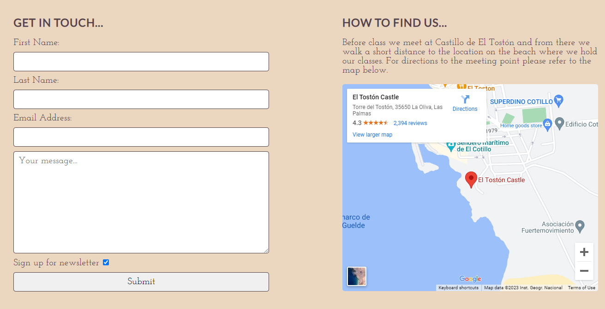

# Beach Yoga Fuerteventura
Beach Yoaga Fuerteventura is a website designed for a fictional yoga club in El Cotillo, Fuerteventura. The website is designed for the client, the yoga club, and also for the user. It's purpose is to provide information about yoga and the club. It is aimed at people who are interested in yoga who are living in or visting the area. It also provides an area to request more information if desired.

To visit the live link to Fuerteventura Beach Yoga on GitHub pages click [here](https://decant09.github.io/beach-yoga-fuerteventura/).  

## Contents

## User Experience

### Initial Discussion
Beach Yoga Fueteventura is a fictional yoga club based in El Cotillo, Fuerteventura. In this scenario the client is looking to provide information for potential interested clients. The area is very touristy so the club sees alot of transient visitors as well as regular clients also. In that sense the clubs is looking to recruit experienced clients as well as clients with experience.  
**Key information for the site:**
- A brief introduction describing what the club is about.
- Information about the benefits of yoga.
- A timetable providing the schedule.
- Information about classes.
- A map showing where the meet-up point is.

### User Stories
#### Client Goals
- The site must be have a calming appearance on visiting.
- Key information must be easily found and the website should be navigatable.
- The site must be available to access on a range of devices, in particular mobile.
- There must be an area to allow interested clients to get in touch.
- There should be links to social media pages.
#### First Time Visitor Goals
- I want to find out what Beach Yoga Fuerteventura is.
- I want to know what why I should do yoga.
- I want to find information easily.
- I want to find a schedule.
- I want to learn about what types of yoga are taught.
- I want to find the location of the class.
#### Returning Visitor Goals
- I want there to be a schedule so I can see if there are any changes to class times.
- If I need more information that there is a place to make contact.
- I want to be able to locate the social media pages.
#### Frequent Visitor Goals
- I want a contact area so I can leave some feedback on the classes.
- I want to be able to sign up to a newsletter.
### Design
#### Colour Scheme
The website colour palette was generated in a two steps, firtly by importing the hero image to [colormind](http://colormind.io). This then generated colours based on the image uploaded. I opted for the colour of #E2D6DC. This is a calming off-white pink colour which I chose as the background colour throughout.  

Secondly, using this colour from colormind as a starting point, I used [ColorSpace](https://mycolor.space/?hex=%23E2D6DC&sub=1) to generate a classy palette.  
  
From this colour palette I chose #54424B, which is grey/black colour, and used this as my font colour throughout.  
I kept the colour palette minimal in an effort to maintain harmony and serenity throughout the website.

#### Typography
I used [Figma](https://www.figma.com/google-fonts/josefin-sans-font-pairings/) for font pairing ideas.  
I chose Josefin slab for the main body font. It contains a little bit of style.   
I chose Lato, a cleaner font, for larger text to create a balanced contrast between the two.  

#### Imagery
The imagery chosen was dones so in an effort to tie in with the main palette of the hero image. Again this was done so to keep the experience of website flowing and relaxing. All imagery used is referenced in the credits in order of appearance as you progress through the website. The logo was generated using [Canva](https://www.canva.com/) and the colour palette used links in with the colour scheme of the website.  

### Wireframes
Wireframes were created for desktop as the website layout is the same across different device screen sizes. The one exception being the contact page, where the form and map areas are repositioned above and below each other on screens sizes of 800px and lower. A wireframe is provided to show this layout.  
- Home Page  
  
- Schedule Page  
  
- Contact Page
    - Desktop  
      
    - Screen Sizes below 800px  
      
- Thank You Page  
  

## Features
The website is made up of four pages. A home page, schedule page, contact page and a thank you page. The first three of these are accessible using the navigation bar. The fourth page is a thank you page which you land on when submit your contact form. The main structure of each page is a header, a body which contains information or a feature to access more information, and a footer.
- Header
    - Contained in the header is the Beach Yoga Fuertventura logo. This is also a link to the home page through out the website.
    - The navigation bar is located below the logo. Each element of the navigation bar is evenly spaced out in a horizontal or row-like fashion. This is maintained on all screen sizes. From here you can access each of the main three pages of the website.
    - This header layout is also maintained on the thank you page so you can easily navigate back to any of the three main pages from here.
  
- Footer
    - The footer contains social media links (Facebook, YouTube and Instagram) and an e-mail link.
    - The e-mail link, an envelope icon, takes you to an e-mail application, if there is one installed on your device. The application will open with the e-mail address "info@beachyogafuerteventura.com" in the recipient field and the word "Information" in the subject field.  
    - Universally recognisable icons for each media link and are given a clear space to occupy. This is maintained across device sizes.
  
- Home Page
    - Below the header on the home page is the hero image. This is lady in the reverse prayer yoga move facing the ocean. To the side of her is some text which states the name of the actiivty (Beach Yoga), where it is located (in El Cotillo, Fuerteventura), and a short statement about what this yoga group is for (Yoga for the mind, body and soul).  
    - This is followed by a yoga quote credited to Linda Sparrowe and below this an image of a lady in dancers pose yoga move on a beach which spans the width of the screen.
    - The "About Us" section describes what Beach Yoga Fuerteventura is and an image of a yoga class on a beach, with a teacher facing some students, follows this spans the width of the screen. 
    - A why yoga section describes the benefits to doing yoga.
- Schedule Page
    - Below the header on the schedule page is an image of a beach with seven stones stacked on top of each other in a column. This is an image synonymous with yoga and represents the seven chakras of the body. Overlaying this image is the word "Schedule" making it clear that you are on the schedule page.
    - A timetable shows the days, type of yoga and time of each yoga class.
    - A section below this describes what the different types of yoga are from the classes in the timetable.

- Contact Page
    - Below the header on the contact page is an image of a beach, a building and some palm trees.  Overlaying this image are the words "Contact Us" making it clear that you are on the contact page.
    - A brief opener to the contact page is followed by a contact form with the option to sign up for a newsletter. This option is automatically ticked when the page loads and can be unticked if required by the user.
    - The form contains a first name text input, last name text , an e-mail address input and a text area to leave a message, followed by the newletter check-box and a submit button.
    - Adjacent to the form is a map with a pin drop location on it. As there is no exact physical location for Beach Yoga Fuerteventura, the pin drop on the map is provided to show a meeting point before class.
    - The form and map are located adjacent to each other but on smaller screen size a media query is used to allow each component to separate and occupy the width of the screen, form first, followed by map. 

- Thank You Page
    - A page containing an image of a beach with the sun setting over the ocean. The message "Thank you! We will be in touch shortly." overlays the image.
- Future Features
    - Add a frequently asked questions page for further information for first time visitors to utilize.
    - Add further images of yoga classes on the beach.

##  Technologies Used
### Languages
- HTML5
- CSS3
### Frameworks
- Git
    - Used for version control by utilizing the Gitpod terminal to commit to Git and Push to GitHub.
- [Google Fonts](https://fonts.google.com/)
    - Google fonts were used to import the Josefin Slab and Lato font families into the style.css file.
- GitHub
    - Used to store the projects code after being pushed from Git.
- [Font Awesome](https://fontawesome.com/)
    - Used for the social media and e-mail icons in the footer.
- [Canva](https://www.canva.com/)
    - The logo image was created using Canva.
- [Tinypng](https://tinypng.com/)
    - Used to compress image files down to smaller size before uploading to website.
- Google Dev Tools
    - Used for responsive investigations, to isolate code and to troubleshoot and test features.
- [Maps.ie](https://maps.ie)
    - Used to obtain code to embed in iframe for google map display.
- [Am I Responsive](https://ui.dev/amiresponsive?url=https://decant09.github.io/beach-yoga-fuerteventura/)
    - Used to show reponsiveness across different device sizes.

## Testing

### W3C Validator
#### HTML Testing
- index.html 
    - Result - No errors or warnings to show.  

- schedule.html
    - Result - No errors or warnings to show.  

- contact.html
    - Result - No errors or warnings to show.  

- thank-you.html
    - Result - No errors or warnings to show.  

#### CSS Testing
- style.css
    - Result - No errors found.  

### Accessibility Testing
#### WebAIM
- I tested the contrast of the background colour versus the font colour using [WebAIM](https://webaim.org/resources/contrastchecker/?fcolor=54424B&bcolor=E2D6DC).
    -  Result - 6.59:1 - Pass.  
 
#### Google Lighthouse
- index.html
    - Result - 100  

- schedule.html
    - Result - 100  

- contact.html
    - Result - 97  

- thank-you.html
    - Result - 100  

### Manual
- I used Google Dev Tools to test for screen responsiveness.  

- I tested on different browsers (chrome, firefox, safari & edge) to ensure the website preforms as expected across all of these.  

- I tested all the media links and hyperlinks on the website manually to ensure that they are all working as expexted. The media links redirect accordingly and the email link opens up as expected. The links in the main body of the website redirected appropraiately to the websites they are linked to and open in new tabs as intended.  

- I tested the form. It behaves as expected. The form can not be submitted until all fields are completed and there is an @ symbol in the e-mail field. If the submit button is clicked before completing the required fields a tooltip will highlight the field that needs attention. The newsletter check-box is ticked upon landing on the page and can be unticked if preferred. When all fields are completed and the submit button clicked you are re-directed to the thank you page as intended.

- I spellchecked the website by copying the text content to [Online Spellcheck](https://www.online-spellcheck.com/).

### Testing User Stories from User Experience (UX) Section
#### First Time Visitor Goals
- I want to find out what Beach Yoga Fuerteventura is.
    - There is an about us section on the home page to explain what Beach Yoga Fuerteventura is about.  

- I want to know what why I should do yoga.
    -There is a section describing some of the benefits of yoga and an underlined link to a website that provides more information.  

- I want to find information easily.
    - The pages of the website are not heavily populated with content. The home page is puntucated by images breaking the page up making it an easy experience to find information.
    - There is a navigation bar in the header to help navigate the site.  

- I want to find a schedule.
    - There is a timetable on the schedule page showing the class types and days and times they are on.
  
- I want to learn about what types of yoga are taught.
    - There is a section beneath the timetable expalining what the different types of yoga are that are in the classes. There is also an underlined link to a website that provides more information on the different types of yoga.  
  
- I want to find the location of the class.
    - There is a map showing the meet up location to meet at before class.  

#### Returning Visitor Goals
- I want there to be a schedule so I can see if there are any changes to class times.
    - The timetable on the schedule page is used to address this goal (screenshot above).
- If I need more information that there is a place to make contact.
    - The contact form on the contact page can used to leave a message.
  
    - There is also a e-mail option in the footer to send an e-mail.
- I want to be able to locate the social media pages.
    - Links to the social media pages are located in the footer.

#### Frequent Visitor Goals
- I want a contact area so I can leave some feedback on the classes.
    - The contact form provides an opportunity to do this (screenshot above).
- I want to be able to sign up to a newsletter.
    - There is a newsletter check-box that is automatically ticked when landing on the page (it can also be unticked). This can be signed up for when submitting a message through the contact form.  

### Bugs
#### Known
- The whole header area is a hyperlink as opposed to just the logo area which is intended. If time permitted [stack overflow](https://stackoverflow.com/questions/40826300/how-to-place-an-image-in-a-header-surrounded-by-an-anchor-tag-and-make-the-image) is a useful possible solution.
- When viewed using safari on Apple iPhone 11 the timetable aligs to the right of the screen. It should appear as expected in the middle of the screen which it does on safari on an Apple iMac desktop. Unfortunately I was not able to resolve this bug.
#### Solved
- When the website was viewed using the link from the gitpod port the images on the website appeared as expected. However, when the website was viewed using the GitHub pages url the images did not appear at all. This was due to a leading "/" in image src path which when removed resolved the issue.
- The navigation bar was not lining up centrally. I noticed this as the schedule link was offset against the logo. Using dev tools I was able to see that there was some default marginm being applied at the start of the navigation bar which when removed resulted in the preferred alignment.
- The dancers pose image, the second image on the home page would strectch and become distorted as the screen size reduced. This was rescolved by applying object-position to cover.
- The text overlaying the hero image would begin to lay over the central figure hero image when the screen size reduced. This would have impacted it's clarity. This was resolved by enabling the hero image to move to the right using a background position rule in the media query and also by reducing the area that the text was allowed to occupy.
- At lower screen sizes the map and form did not behave as expected. They would display as block elements as intended however they did not cover the entire block and occupy the screen width. I realized that my media query rule was targeting the correct title to target, however I was targeting an id selector as opposed to a class selector. After identifying this and tidying up some margin rules the issues was resolved.

## Deployment
The site was deployed to GitHub pages and the following steps were followed to do so:

1. Login in to GitHub.
2. Navigate to the [repository](https://github.com/decant09/beach-yoga-fuerteventura) for this website.
3. In the repository click on the Settings tab.
4. Use the navigation bar on the left hand side to open the pages section.
5. In the branch section select a source to enable GitHub Pages for this repository. Select Main from the drop-down menu and click Save.
6. Wait a few moments and an url is generated with a live link to the website which can be found [here](https://decant09.github.io/beach-yoga-fuerteventura/).

## Credits
### Code Used
- Used the code from the Love Running website to develop the footer element. 

### Images
- The hero image is from [Pexels](https://www.pexels.com/photo/a-woman-meditating-at-the-beach-6712374/).  
- The dancers pose image is from [Pexels](https://www.pexels.com/photo/woman-in-yoga-pose-on-beach-13894711/).  
- The yoga class image is from [Unsplash](https://unsplash.com/photos/GaprWyIw66o).  
- The schedule image is from [Unsplash](https://unsplash.com/photos/aHll22KZdJE).  
- The contact us image is from [Pexels](https://www.pexels.com/photo/palm-trees-around-beach-in-village-15739715/).  
- The thank you image is from [Unsplash](https://unsplash.com/photos/KMn4VEeEPR8).  

### Logo  
- The logo image was generated using [Canva](https://www.canva.com).

### Map  
- I was able to embed the Google map iframe by using [Maps.ie](https://www.maps.ie/)

### Clickable Links
- The _Benefits_ hyperlink in the "Why Yoga?" section on the home page: 9 Benefits of Yoga from [Johns Hopkins Medicine](https://www.hopkinsmedicine.org/health/wellness-and-prevention/9-benefits-of-yoga).  
- The _Yoga_ hyperlink in the "Classes" section on the schedule page: a beginner's guide to the different styles from [The Guardian](https://www.theguardian.com/lifeandstyle/2014/jan/10/yoga-beginners-guide-different-styles)  

### Resources
- To to create an e-mail link in HTML referred to [wikihow](https://www.wikihow.com/Create-an-Email-Link-in-HTML)
- Used [CSS tricks](https://css-tricks.com/table-with-borders-only-on-the-inside/) to create the desired table border and to centre the table in the parent container used [stack overflow](https://stackoverflow.com/questions/7059394/how-to-position-a-table-at-the-center-of-div-horizontally-vertically).
- For image positioning [stack overflow](https://stackoverflow.com/questions/16177707/avoid-stretch-on-image-css), [CSS tricks](https://css-tricks.com/almanac/properties/o/object-position/) and [MDN](https://developer.mozilla.org/en-US/docs/Web/CSS/object-position).
- Flexbox used throughout and referred to [Flexbox Froggy](https://flexboxfroggy.com/) for help.
- Background positioning for hero image was resolved using [MDN](https://developer.mozilla.org/en-US/docs/Web/CSS/background-position)
- To split screen as for the form and map area used [W3Schools](https://www.w3schools.com/howto/howto_css_split_screen.asp).
- For help with margins referred to [MDN](https://developer.mozilla.org/en-US/docs/Web/CSS/margin).

### Acknowledgements
- My Mentor Chris Quinn for continuous helpful feedback.
- Tutor support at Code Institute for their amazing support.
- Alan Bushell at Code Institute for guiding the class in our weekly stand ups.